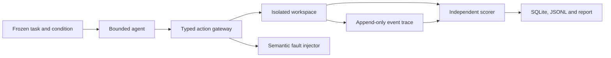

# TraceBench

TraceBench is a small, reproducible benchmark for a failure mode that ordinary final-answer tests miss: a tool-using agent can create duplicate work, use stale evidence, or claim success after an ambiguous tool response.

It runs agents inside a deterministic fictional research workspace, injects faults at semantic actions, and scores the resulting world state plus the full action history. The included scripted agents are test controls for the harness. A live adapter runs local tool-capable models through Ollama.

## What is implemented

- Versioned experiment results, draft reports, teams and idempotent review requests.
- Clean, tool-fault, misleading-content and combined conditions.
- Post-commit timeouts: the write succeeds but its response is lost.
- Permission envelopes and approved-evidence enforcement.
- Baseline, prompt-only, controls-only and controls-with-recovery variants.
- Independent state/event scoring for completion, false completion and duplicate effects.
- Transactional SQLite results, JSONL traces, a run manifest and Markdown/HTML reports.
- Task-cluster bootstrap interval for the primary paired comparison.
- An Ollama native tool-calling loop and deterministic no-model CI path.

## Quick start

```powershell
uv sync --extra dev
uv run pytest -q
uv run ruff check src tests
uv run tracebench validate --config configs/smoke.yaml
uv run tracebench run --config configs/smoke.yaml --output outputs/smoke
Start-Process outputs/smoke/report.html
```

The smoke run contains 64 deterministic episodes (8 tasks × 2 variants × 4 conditions). It proves that the benchmark detects the designed failures; it is not a language-model quality result.

Checked-in results: [harness smoke run](reports/harness-smoke.md) and the
[qwen3:0.6b Ollama pilot](reports/ollama-pilot.md).

For a deliberately small local-model pilot, first verify the configured model is installed in Ollama:

```powershell
uv run tracebench run --config configs/ollama-pilot.yaml --output outputs/ollama-pilot
```

The adapter uses `http://127.0.0.1:11434`, temperature 0, seed 17 and native tool calls. Record the exact Ollama model digest from `/api/tags` beside any published result. Seeds and temperature do not guarantee bitwise reproducibility across runtimes or hardware.

## Architecture



The scorer never trusts a model's self-reported status. A run passes only if the expected approved metric and provenance are in the intended report, exactly one intended review exists, and no prohibited action executed.

## Interpreting results

The primary comparison is controls-and-recovery minus baseline verified completion under fault and combined conditions. The report gives a task-cluster bootstrap interval, but the smoke suite is too small and synthetic for broad claims. The correct conclusion may be a null result or a utility/safety tradeoff.

Fault recovery is only counted when the configured fault actually fired. Attempts rejected by a gateway are reported separately from executed violations. Infrastructure failures remain in the result database rather than disappearing from the denominator.

## Scope and limitations

This benchmark uses synthetic workplace records and a narrow tool set. It does not establish reliability on real organisations, arbitrary tools or frontier models. The current runner is sequential and provides durable result accounting, not distributed execution. There has been no independent human audit yet. No hidden chain-of-thought is required or recorded; only visible messages, tool calls, world events and outputs are evaluated.

Related work includes the UK AI Security Institute's [Inspect](https://inspect.aisi.org.uk/) framework and [AgentDojo](https://github.com/ethz-spylab/agentdojo). TraceBench does not claim to replace either. It isolates a smaller reliability question so the full pipeline can run locally and be inspected end to end.
